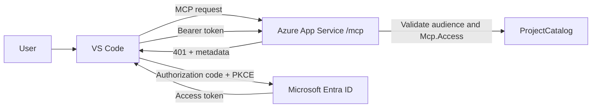

# Hosted MCP with One Microsoft Entra App Registration

This guide configures the hosted MCP endpoint with **one** Microsoft Entra app registration. The same registration acts as:

- The protected API that exposes the `Mcp.Access` delegated scope.
- The public client used by VS Code to sign in with authorization code flow and PKCE.

This is suitable for an internal POC or a small single-client deployment. Use separate API and client registrations when multiple clients, independent client lifecycle, or stricter separation of responsibilities is required.

## Target architecture



Only one app registration is created:

| Purpose | Configuration in the same registration |
|---|---|
| Protected MCP API | Application ID URI and delegated `Mcp.Access` scope |
| VS Code OAuth client | Public-client flow and VS Code redirect URIs |

## 1. Create one app registration

1. Open **Microsoft Entra admin center**.
2. Go to **Identity** > **Applications** > **App registrations**.
3. Select **New registration**.
4. Enter a name such as `Gov Projects MCP`.
5. Select **Accounts in this organizational directory only**.
6. Select **Register**.
7. Copy the **Application (client) ID**. This value is called `APP_CLIENT_ID` below.
8. Copy the **Directory (tenant) ID**. This value is called `TENANT_ID` below.

For the existing workspace, the values are currently:

```text
TENANT_ID    = 2d71cc54-bc9e-4518-aebc-618c6aa63f9a
APP_CLIENT_ID = 4607dd35-d940-4d77-af36-748b833504f1
```

Use your own values when creating a new registration. Do not put client secrets in this application or in `.vscode/mcp.json`.

## 2. Expose the MCP API scope

In the new app registration:

1. Open **Expose an API**.
2. Select **Add** beside **Application ID URI**.
3. Keep the default value:

   ```text
   api://APP_CLIENT_ID
   ```

4. Select **Add a scope**.
5. Set **Scope name** to `Mcp.Access`.
6. Set **Who can consent?** to **Admins and users**.
7. Enter a display name such as `Access hosted MCP tools`.
8. Enter a description such as `Allows the signed-in user to call hosted MCP tools.`
9. Leave the scope enabled and select **Add scope**.

The resulting scope must be:

```text
api://APP_CLIENT_ID/Mcp.Access
```

## 3. Configure the same registration as a public client

1. Open **Authentication** in the same app registration.
2. Select **Add a platform**.
3. Select **Mobile and desktop applications**.
4. Add these exact redirect URIs:

   ```text
   http://127.0.0.1:33418
   https://vscode.dev/redirect
   ```

5. Under **Advanced settings**, set **Allow public client flows** to **Yes**.
6. Select **Save**.

Do not create a client secret. VS Code is a public client and uses PKCE.

## 4. Grant the scope to the same application

Because the same app registration is both the client and the API, add its own delegated permission:

1. Open **API permissions**.
2. Select **Add a permission**.
3. Select **My APIs**.
4. Select the same `Gov Projects MCP` app registration.
5. Select **Delegated permissions**.
6. Select `Mcp.Access`.
7. Select **Add permissions**.
8. Select **Grant admin consent for `<your tenant>`** if your tenant requires administrator consent.

The permission should appear as a delegated permission for the same application registration.

## 5. Configure the ASP.NET Core application

Set the tenant ID, the single registration's client ID, and the public App Service URL in `Gov.WebApi/appsettings.json` or, preferably, in App Service application settings:

```json
{
  "Authentication": {
    "TenantId": "TENANT_ID",
    "ApiClientId": "APP_CLIENT_ID"
  },
  "PublicBaseUrl": "https://APP_SERVICE_HOSTNAME"
}
```

For Azure App Service, configure these as application settings instead of committing environment-specific values to source control:

```text
Authentication__TenantId=TENANT_ID
Authentication__ApiClientId=APP_CLIENT_ID
PublicBaseUrl=https://APP_SERVICE_HOSTNAME
```

The existing `Gov.WebApi/Program.cs` already uses `Authentication:ApiClientId` to derive:

```text
OAuth resource: api://APP_CLIENT_ID
MCP scope:      api://APP_CLIENT_ID/Mcp.Access
```

It also validates the token issuer, lifetime, signing key, audience, and `scp` claim. The MCP route remains protected by the `McpAccess` policy:

```csharp
app.UseAuthentication();
app.UseAuthorization();

app.MapMcp("/mcp")
    .RequireAuthorization("McpAccess");
```

## 6. Configure VS Code MCP

Update `.vscode/mcp.json` so `oauth.clientId` is the **same** client ID used by the API:

```json
{
  "servers": {
    "gov-projects": {
      "type": "http",
      "url": "https://APP_SERVICE_HOSTNAME/mcp",
      "oauth": {
        "clientId": "APP_CLIENT_ID"
      }
    }
  }
}
```

For the existing deployment, the effective configuration is:

```json
{
  "servers": {
    "gov-projects": {
      "type": "http",
      "url": "https://rtest-mcp-web-api-btb9cghwhxghb9bg.westus3-01.azurewebsites.net/mcp",
      "oauth": {
        "clientId": "4607dd35-d940-4d77-af36-748b833504f1"
      }
    }
  }
}
```

The previous separate VS Code client ID must not be used in this one-registration configuration.

## 7. Publish and deploy

From the workspace root:

```powershell
dotnet publish .\Gov.WebApi\Gov.WebApi.csproj -c Release -o .\publish
Compress-Archive -Path .\publish\* -DestinationPath .\gov-webapi.zip
az webapp deploy `
  --resource-group rtest-ai-test `
  --name rtest-mcp-web-api `
  --src-path .\gov-webapi.zip `
  --type zip `
  --clean true `
  --restart true
```

Configure the App Service health-check path as:

```text
/health
```

## 8. Start the MCP server in VS Code

1. Open the workspace in VS Code 1.99 or later.
2. Run **MCP: Reset Cached Tools**.
3. Run **MCP: List Servers**.
4. Select `gov-projects`, then select **Start** or **Restart**.
5. Accept the MCP server trust prompt.
6. Complete Microsoft Entra sign-in in the browser.
7. Open Copilot Chat in **Agent** mode.
8. Select **Configure Tools** and enable `get_projects`.
9. Ask: `Use gov-projects to list all available projects.`

VS Code should use the same app registration as both the OAuth client and the protected API resource. It should request this scope:

```text
api://APP_CLIENT_ID/Mcp.Access
```

## 9. Verify the configuration

Public endpoints should continue to work:

```text
GET  /docs                                      -> 200
GET  /health                                    -> 200
GET  /api/project                               -> 200
GET  /.well-known/oauth-protected-resource/mcp -> 200
```

The MCP endpoint must require authentication:

```text
POST /mcp without a token -> 401
POST /mcp after VS Code sign-in -> MCP initialize/tools/list response
```

The protected-resource metadata should contain:

```json
{
  "resource": "api://APP_CLIENT_ID",
  "authorization_servers": [
    "https://login.microsoftonline.com/TENANT_ID/v2.0"
  ],
  "scopes_supported": [
    "api://APP_CLIENT_ID/Mcp.Access"
  ]
}
```

## Troubleshooting

### VS Code does not open the sign-in page

- Confirm `.vscode/mcp.json` uses the single registration's client ID.
- Confirm **Allow public client flows** is enabled.
- Confirm both redirect URIs match exactly.
- Run **MCP: Reset Cached Tools** and restart the server.
- Check the MCP server output in **MCP: List Servers** > `gov-projects` > **Show Output**.

### The MCP endpoint returns 401 after sign-in

Inspect the access token and confirm:

```text
aud  = APP_CLIENT_ID or api://APP_CLIENT_ID
scp  = Mcp.Access
tid  = TENANT_ID
exp  = a future Unix timestamp
```

Also confirm the server's `Authentication:TenantId` and `Authentication:ApiClientId` values match the registration used by VS Code.

### Entra reports that the resource and scope do not match

Use the Application ID URI as the OAuth resource and scope:

```text
resource = api://APP_CLIENT_ID
scope    = api://APP_CLIENT_ID/Mcp.Access
```

Do not use the App Service HTTPS URL as the OAuth resource.

## When to use two registrations instead

Move to separate API and client registrations when:

- More than one client application needs access.
- The client and API have different owners or release lifecycles.
- You need to revoke or replace the client without changing the API identity.
- You want stricter administrative separation between resource and client permissions.

For the one-registration setup, the answer is **one Entra app registration**, configured with both **Expose an API** and **Mobile and desktop applications** settings.
