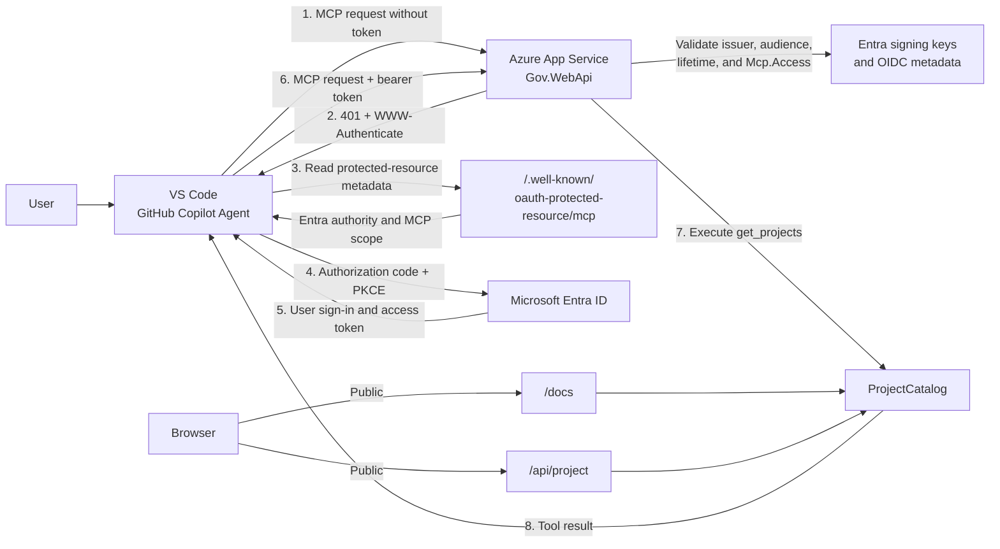
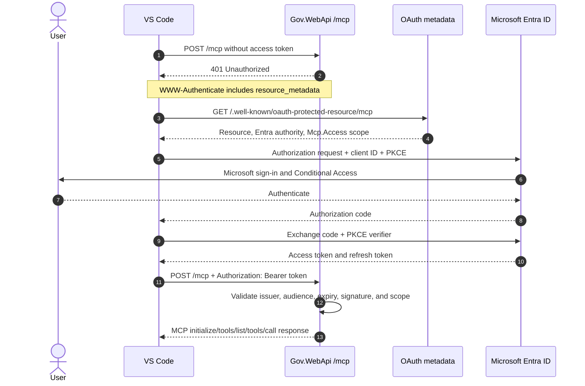

# Hosted MCP Authentication with Microsoft Entra ID

## Overview

`Gov.WebApi` is deployed to Azure App Service and exposes the project catalog through both REST and the Model Context Protocol (MCP).

| Surface | URL | Authentication |
|---|---|---|
| Interactive Swagger UI | `https://rtest-mcp-web-api-btb9cghwhxghb9bg.westus3-01.azurewebsites.net/docs` | Public |
| ReDoc reference | `https://rtest-mcp-web-api-btb9cghwhxghb9bg.westus3-01.azurewebsites.net/reference` | Public |
| REST projects endpoint | `https://rtest-mcp-web-api-btb9cghwhxghb9bg.westus3-01.azurewebsites.net/api/project` | Public |
| Health check | `https://rtest-mcp-web-api-btb9cghwhxghb9bg.westus3-01.azurewebsites.net/health` | Public |
| Streamable HTTP MCP endpoint | `https://rtest-mcp-web-api-btb9cghwhxghb9bg.westus3-01.azurewebsites.net/mcp` | Microsoft Entra ID |

The MCP endpoint uses OAuth 2.0 authorization-code flow with PKCE. VS Code opens the Microsoft sign-in page when authorization is needed, obtains an access token, and sends it as a bearer token with every MCP request.

## Architecture



## Entra application registrations

Two single-tenant registrations separate the protected API from the public desktop client.

### Gov Projects MCP API

| Property | Value |
|---|---|
| Display name | `Gov Projects MCP API` |
| Application (client) ID | `4607dd35-d940-4d77-af36-748b833504f1` |
| Application ID URI | `api://4607dd35-d940-4d77-af36-748b833504f1` |
| Delegated scope | `api://4607dd35-d940-4d77-af36-748b833504f1/Mcp.Access` |
| Access-token version | 2 |
| Tenant | `2d71cc54-bc9e-4518-aebc-618c6aa63f9a` |

This registration represents the protected MCP resource. `Gov.WebApi` accepts only tokens issued for this audience and containing the `Mcp.Access` delegated scope.

### Gov Projects MCP - VS Code Client

| Property | Value |
|---|---|
| Display name | `Gov Projects MCP - VS Code Client` |
| Application (client) ID | `f7a70915-ed0e-4b85-aee4-52591710d468` |
| Client type | Public client |
| Redirect URI | `http://127.0.0.1:33418` |
| Redirect URI | `https://vscode.dev/redirect` |
| Delegated permission | `Mcp.Access` |
| Client secret | None |

The client uses authorization-code flow with PKCE. A public client must not contain a client secret.

The API registration pre-authorizes this VS Code client for `Mcp.Access`. Tenant policies can still require administrator consent or apply Conditional Access.

## Authentication sequence



## Server implementation

The application uses:

- `ModelContextProtocol.AspNetCore` for the stateless Streamable HTTP MCP server.
- `Microsoft.AspNetCore.Authentication.JwtBearer` for Entra access-token validation.
- `ModelContextProtocol.AspNetCore.Authentication` for MCP OAuth challenges and protected-resource metadata.

The relevant application configuration is:

```json
{
  "Authentication": {
    "TenantId": "2d71cc54-bc9e-4518-aebc-618c6aa63f9a",
    "ApiClientId": "4607dd35-d940-4d77-af36-748b833504f1"
  },
  "PublicBaseUrl": "https://rtest-mcp-web-api-btb9cghwhxghb9bg.westus3-01.azurewebsites.net"
}
```

Authentication protects only the MCP route:

```csharp
app.UseAuthentication();
app.UseAuthorization();

app.MapMcp("/mcp")
    .RequireAuthorization("McpAccess");
```

The `McpAccess` policy requires:

1. An authenticated user.
2. A valid Entra-issued JWT.
3. An audience of the MCP API registration.
4. An `scp` claim containing `Mcp.Access`.

REST, Swagger, ReDoc, and health routes remain public. Apply authorization to those routes separately if their data must also be protected.

## MCP discovery metadata

The server publishes metadata at:

```text
https://rtest-mcp-web-api-btb9cghwhxghb9bg.westus3-01.azurewebsites.net/.well-known/oauth-protected-resource/mcp
```

The response identifies:

```json
{
  "resource": "api://4607dd35-d940-4d77-af36-748b833504f1",
  "authorization_servers": [
    "https://login.microsoftonline.com/2d71cc54-bc9e-4518-aebc-618c6aa63f9a/v2.0"
  ],
  "scopes_supported": [
    "api://4607dd35-d940-4d77-af36-748b833504f1/Mcp.Access"
  ],
  "resource_documentation": "https://rtest-mcp-web-api-btb9cghwhxghb9bg.westus3-01.azurewebsites.net/docs"
}
```

The OAuth resource is the Entra Application ID URI, while the MCP transport remains the HTTPS App Service URL. This distinction is required because Entra binds requested scopes and tokens to the registered API resource.

## VS Code registration

The workspace configuration is stored in `.vscode/mcp.json`:

```json
{
  "servers": {
    "gov-projects": {
      "type": "http",
      "url": "https://rtest-mcp-web-api-btb9cghwhxghb9bg.westus3-01.azurewebsites.net/mcp",
      "oauth": {
        "clientId": "f7a70915-ed0e-4b85-aee4-52591710d468"
      }
    }
  }
}
```

To activate it:

1. Open the workspace in VS Code 1.99 or later.
2. Run **MCP: Reset Cached Tools** after changing authentication or tools.
3. Run **MCP: List Servers**.
4. Select `gov-projects`, then select **Start** or **Restart**.
5. Accept the MCP server trust prompt.
6. Complete Microsoft Entra sign-in in the browser.
7. Open Copilot Chat in **Agent** mode.
8. Select **Configure Tools** and confirm `get_projects` is enabled.
9. Ask: `Use gov-projects to list all available projects.`

VS Code securely caches OAuth tokens. A browser prompt normally appears on first authorization, after logout or token expiration, or when Conditional Access requires interaction. Authentication is enforced on every MCP request even when sign-in happens silently.

## Azure App Service deployment

1. Publish the application:

   ```powershell
   dotnet publish .\Gov.WebApi\Gov.WebApi.csproj -c Release -o .\publish
   ```

2. Package the contents of `publish`, not the directory itself:

   ```powershell
   Compress-Archive -Path .\publish\* -DestinationPath .\gov-webapi.zip
   ```

3. Deploy:

   ```powershell
   az webapp deploy `
     --resource-group rtest-ai-test `
     --name rtest-mcp-web-api `
     --src-path .\gov-webapi.zip `
     --type zip `
     --clean true `
     --restart true
   ```

4. Configure the App Service health-check path as `/health`.

5. Verify:

   ```text
   GET  /docs                                      -> 200
   GET  /health                                    -> 200
   GET  /.well-known/oauth-protected-resource/mcp -> 200
   POST /mcp without token                         -> 401
   POST /mcp with valid token and Mcp.Access       -> MCP response
   ```

## Security considerations

- Never store a client secret for the VS Code public client.
- Validate token signature, issuer, audience, lifetime, and delegated scope.
- Do not accept Microsoft Graph or Azure Resource Manager tokens at `/mcp`.
- Keep the API single-tenant unless cross-tenant access is explicitly required.
- Use HTTPS only in Azure App Service.
- Restrict Entra user assignment or add Conditional Access when access should be limited.
- Protect REST and documentation routes separately if they expose sensitive information.
- Keep OAuth tokens out of source control, logs, query strings, and application settings.
- Review the Entra enterprise applications periodically and remove obsolete grants.

## Troubleshooting

### VS Code does not open the sign-in page

1. Confirm `.vscode/mcp.json` contains the `oauth.clientId`.
2. Run **MCP: Reset Cached Tools**.
3. Restart `gov-projects` through **MCP: List Servers**.
4. Run **MCP: Reset Trust** if the server configuration changed.
5. Use **MCP: List Servers** → `gov-projects` → **Show Output**.
6. Confirm the organization's **MCP servers in Copilot** policy is enabled.

### The MCP server returns 401 after sign-in

Check that the token contains:

- `aud`: `4607dd35-d940-4d77-af36-748b833504f1` or `api://4607dd35-d940-4d77-af36-748b833504f1`
- `scp`: `Mcp.Access`
- `tid`: `2d71cc54-bc9e-4518-aebc-618c6aa63f9a`
- A valid, unexpired `exp`

Also verify the API registration is configured to issue version 2 access tokens.

### Entra reports a redirect URI mismatch

Ensure the public-client registration contains both exact redirect URIs:

```text
http://127.0.0.1:33418
https://vscode.dev/redirect
```

### Entra reports that resource and scopes do not match

The MCP protected-resource metadata must use:

```text
resource = api://4607dd35-d940-4d77-af36-748b833504f1
scope    = api://4607dd35-d940-4d77-af36-748b833504f1/Mcp.Access
```

Do not combine the App Service HTTPS URL as the OAuth resource with an `api://` scope.

### `/docs` works but MCP does not

`/docs` is intentionally public and does not prove MCP authentication is working. Verify that an anonymous `POST /mcp` returns `401` with a `WWW-Authenticate` header containing a protected-resource metadata URL.

## Operational ownership

Changes require coordination across these surfaces:

| Change | Required updates |
|---|---|
| App Service hostname | `PublicBaseUrl`, `.vscode/mcp.json`, redeployment |
| API client ID | API registration, server configuration, scope, VS Code client permission |
| VS Code client ID | Public-client registration and `.vscode/mcp.json` |
| Tenant | Both registrations, server authority, and tenant policies |
| MCP scope | API registration, pre-authorization, server policy, metadata |

